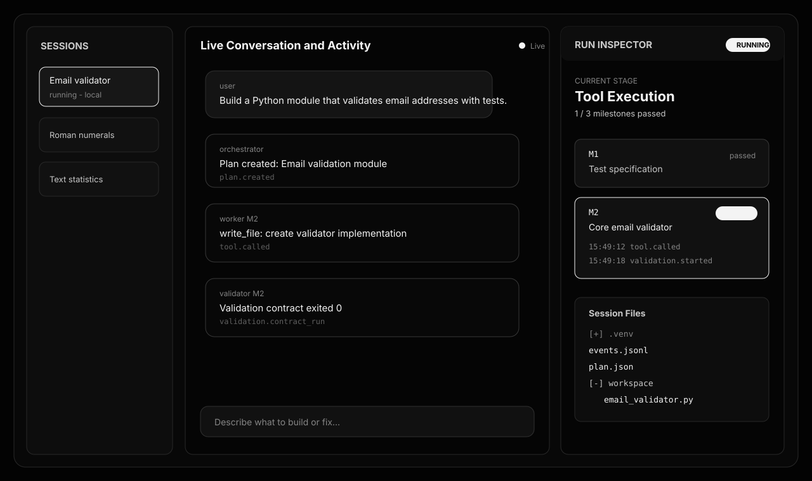
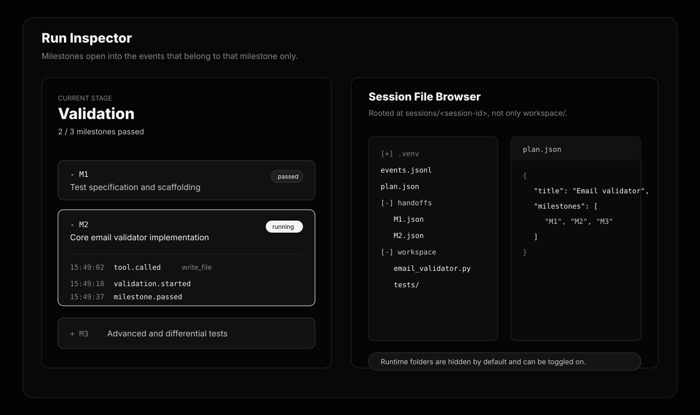

# Missions Architecture — Self-Improving Multi-Agent Coding Runtime

A serial multi-agent system for building software with **small local LLMs**. The runtime decomposes a user request into milestones, routes a minimal tool set per step, implements code in an isolated workspace, and validates each milestone against an explicit **Validation Contract** before committing. Failed milestones retry with grounded error feedback; structural contract flaws trigger **negotiated replanning** with the Orchestrator.

This repo is a proof of concept: the architecture (not raw model scale) is what makes local 27B-class models usable for non-trivial Python tasks.

---

## Why this architecture exists

Large cloud models tolerate sloppy agent design. Small local models do not. This stack applies standard software-engineering discipline to the agent loop:

| Principle | How it is enforced |
|---|---|
| **Separation of concerns** | Orchestrator plans; Worker implements; Validator adversarially checks. No role shares another role's prompt or tools. |
| **Contract-first delivery** | Every milestone ships with a machine-runnable `validation_contract.command` (pytest, lint, shell). PASS is deterministic before merge. |
| **Negotiation through contracts** | Validator can emit `REPLAN` when the plan itself is wrong (e.g. test command mismatch). Orchestrator emits a small patch op-list (`set_contract` / `update_milestone` / `insert` / `remove`) applied deterministically — the whole plan is never regenerated. |
| **Anti spec-gaming** | Workers cannot edit test files during implementation milestones, and cannot write outside the milestone's `target_files` at all. Both guardrails reject at the tool layer (one cheap turn) instead of post-hoc by the validator. |
| **Grounded context** | Qdrant injects 2–3 relevant tools per milestone (not all 12). A JSON memory store records failures and milestone state; Cognee is opt-in and fire-and-forget when enabled. |
| **Diff-first editing** | Full `write_file` rewrites of existing files >60 lines are rejected unless the file was read first this milestone (or `rewrite=true`). Keeps decode cost low and regressions rare. |
| **Serial execution** | One LLM call at a time — required on dual 16 GB GPUs where parallel agents would OOM. |
| **Observability** | Arize Phoenix traces Orchestrator / Worker / Validator calls; `llm.call` events with token counts and prefill/decode timing land in `events.jsonl`; the web UI streams session events in real time. |

---

## Execution flow

```
User request
     │
     ▼
┌─────────────────────────────────────────┐
│ 1. ORCHESTRATION                        │
│    config/orchestrator.md → plan.json   │
│    Milestones + Validation Contracts    │
│    Corrective JSON retries (≤2)        │
└─────────────────┬───────────────────────┘
                  │
                  ▼
┌─────────────────────────────────────────┐
│ 1.2 PLAN LINT (deterministic, no LLM)   │
│    Strip workspace/ prefixes, retype    │
│    shell contracts, drop dangling     │
│    depends_on, flag policy-denied cmds │
│    → one Orchestrator patch pass for   │
│    issues the linter can't auto-fix    │
└─────────────────┬───────────────────────┘
                  │
                  ▼
┌─────────────────────────────────────────┐
│ 2. DYNAMIC SKILL ROUTING (per milestone)│
│    Qdrant hybrid retrieval → top 3 tools│
└─────────────────┬───────────────────────┘
                  │
                  ▼
┌─────────────────────────────────────────┐
│ 3. WORKER (json_mode, batched ≤3 calls) │
│    config/worker.md + curated tools     │
│    Write jail scoped to target_files   │
│    Auto-runs contract after each write │
│    Conversation resumes across retries │
└─────────────────┬───────────────────────┘
                  │
                  ▼
┌─────────────────────────────────────────┐
│ 4. VALIDATION (diff + contract output) │
│    Run contract command + structural QA │
│    Inject bounded git diff to LLM      │
│    PASS → git commit                    │
│    FAIL → retry Worker (≤3) w/ raw     │
│           contract output + memory     │
│    REPLAN → patch ops (budget ≤2,      │
│             fingerprint dedup)         │
└─────────────────────────────────────────┘
```

On **PASS**, the runtime commits workspace changes and writes handoff JSON under the active session. On crash, the session-local `plan.json`, event log, handoffs, and memory store allow resume.

---

## Project layout

```
config/
  orchestrator.md      # Planning persona + contract rules + patch-ops format
  worker.md            # Implementation persona + batched tool-call format
  validator.md        # Adversarial QA persona + diff review
  skills.md            # 12 tools (chunked for Qdrant indexing)

src/
  main.py              # MissionsRuntime — serial pipeline + replan circuit breakers
  llm_client.py        # local → gemini → gpt4o fallback chain; per-role temp/tokens
  tool_registry.py     # Cloud Qdrant + BGE embeddings + keyword boost
  memory_layer.py      # JSON store (default) + Cognee (opt-in, fire-and-forget)
  telemetry.py         # Arize Phoenix OpenTelemetry
  api/                 # FastAPI control plane for sessions, runs, events, files
  agents/
    orchestrator.py    # Phase 1 + 1.5: plan + patch-based replan + corrective JSON
    worker.py          # Phase 3: json_mode, batched calls, contract auto-run, resume
    validator.py       # Phase 4: diff injection, failure signatures, raw output
    plan_ops.py        # Deterministic plan patch validation + application
    plan_lint.py       # Pre-execution plan lint (schema, contracts, deps)
    utils.py           # JSON parsing, conversation trim, failure fingerprints
  tools/               # file_ops (write jail + diff-first), git_ops, system_ops

frontend/
  src/                 # React control UI
  src/components/      # Chat feed, session sidebar, run inspector, file explorer

sessions/<session-id>/
  session.json         # Session metadata
  plan.json            # Live milestone plan (patched in place)
  events.jsonl         # Append-only event stream (incl. llm.call metrics)
  memory_store.json    # JSON memory (synchronous source of truth)
  handoffs/            # Per-milestone telemetry
  workspace/           # Generated code sandbox
  .venv/               # Session-local Python environment

docs/screenshots/      # README demo visualizations
test_project.txt       # Copy-paste example mission commands
scripts/
  build_llamacpp.sh    # Build TurboQuant llama.cpp for V100+
  download_models.sh   # HuggingFace GGUF downloads
  start_server_speculative.sh  # MTP llama-server on port 8001
```

Legacy MBPP speculative-decoding benchmark code remains under `pipeline/`, `run_experiment.py`, and `analysis/` for reference.

---

## Requirements

- **OS:** Linux with CUDA (tested on dual Tesla V100 16 GB)
- **Python:** 3.10+
- **GPU driver + CUDA toolkit** (for building llama.cpp with `nvcc`)
- **HuggingFace account** with accepted model licenses (Gemma 4 if used)
- **Optional cloud services:** Qdrant Cloud (skill routing), OpenAI (embeddings + optional Cognee), Gemini/GPT-4o fallback

---

## Installation

### 1. Clone and create a virtual environment

```bash
cd coding-agent
python3 -m venv .venv
source .venv/bin/activate
pip install -r requirements.txt
```

Install the React control UI dependencies:

```bash
npm --prefix frontend install
```

### 2. Configure environment

```bash
cp .env.example .env
```

Edit `.env` with at minimum:

```ini
HF_TOKEN=hf_...

# Local llama-server (Missions default backend)
LLM_SPECULATIVE_URL=http://localhost:8001/v1
TARGET_MODEL_GGUF=/path/to/models/your-model.gguf
MODEL_ALIAS=your-model-alias
TARGET_MODEL=your-model-alias

# Per-role sampling (tool-calling needs near-deterministic decoding)
LLM_TEMPERATURE_WORKER=0.2
LLM_TEMPERATURE_ORCHESTRATOR=0.5
LLM_TEMPERATURE_VALIDATOR=0.2

# Worker protocol
MAX_WORKER_BATCH_CALLS=3
WORKER_CONTRACT_AUTORUN_MAX=8

# Tool-call circuit breakers
MAX_SAME_TOOL_FAILURES=2
MAX_CONSECUTIVE_TOOL_FAILURES=5

# Replan circuit breaker
MAX_REPLANS_PER_MILESTONE=2

# Memory backend: json (default, zero latency) | cognee (opt-in)
MISSIONS_MEMORY_BACKEND=json

# Qdrant Cloud (skill routing)
QDRANT_URL=https://....cloud.qdrant.io:6333
QDRANT_API_KEY=...
QDRANT_COLLECTION=agent_skills

# Optional fallbacks
GEMINI_API_KEY=...
OPENAI_API_KEY=...
```

### 3. Build llama.cpp (TurboQuant fork)

Pre-built binaries often lack reliable `sm_70` (V100) kernels. Build from source:

```bash
bash scripts/build_llamacpp.sh
export PATH="$HOME/llama-cpp-turboquant/build/bin:$PATH"
```

Add the `export PATH=...` line to your shell profile.

### 4. Download a model

#### Qwen3.6 / Qwopus3.6 (recommended for this repo)

These families ship **MTP draft weights inside a single GGUF file**. No separate draft download is required. The server uses `--spec-type draft-mtp` on that one file.

```bash
# Qwen3.6 27B MTP (default in download script)
bash scripts/download_models.sh --qwen3627b

# Qwopus3.6 27B MTP
bash scripts/download_models.sh --qwopus3627b
```

Copy the printed `TARGET_MODEL_GGUF`, `MODEL_ALIAS`, and `TARGET_MODEL` lines into `.env`.

#### Gemma 4 (separate draft file required)

Gemma 4 MTP uses a **target GGUF plus a separate assistant/draft GGUF**. Download both:

```bash
bash scripts/download_models.sh --e4b   # or --e2b, --26b, --31b
```

Set `TARGET_MODEL_GGUF` and `DRAFT_MODEL_GGUF` in `.env`. For Gemma, uncomment the draft-related lines in `scripts/download_models.sh` and `scripts/start_server_speculative.sh`, and pass the draft model to `llama-server` (e.g. `--model-draft "$DRAFT_FILE"`).

| Family | Draft model | Download |
|---|---|---|
| Qwen3.6 MTP | Built into target GGUF | `--qwen3627b` |
| Qwopus3.6 MTP | Built into target GGUF | `--qwopus3627b` |
| Gemma 4 | Separate assistant GGUF | `--e4b` / `--e2b` / `--26b` / `--31b` |

### 5. Start the local inference server

Only **one** llama-server should run during Missions (serial design + VRAM budget):

```bash
bash scripts/start_server_speculative.sh
curl http://localhost:8001/v1/models   # confirm live
```

The Missions runtime connects to `LLM_SPECULATIVE_URL` (port **8001**) with `model=auto`, which tries local first.

**MTP / speculative decoding** accelerates token generation on supported models, shortening Orchestrator → Worker → Validator iteration cycles on the same hardware.

### 6. Optional: Phoenix observability

```bash
# Terminal 1 — keep running
phoenix serve
# Dashboard: http://127.0.0.1:6006
```

Set in `.env`:

```ini
PHOENIX_HOST=127.0.0.1
PHOENIX_PORT=6006
PHOENIX_EXTERNAL=true
```

Or set `PHOENIX_EXTERNAL=false` to let the runtime launch Phoenix in-process.

---

## Running a mission

### Web control UI

The recommended interactive path is the browser UI. It exposes a chat-style request box, a session sidebar, a live activity feed, and a resizable run inspector that shows milestone progress, scoped events, and the session file tree.

Start the API server:

```bash
source .venv/bin/activate
python -m src.api --host 127.0.0.1 --port 8088 error
```

Start the frontend in another terminal:

```bash
npm --prefix frontend run dev
```

Open `http://127.0.0.1:5173`. Vite proxies `/api/*` to the FastAPI server on `127.0.0.1:8088`.

The UI is organized around:

- **Sessions:** left sidebar for creating and switching isolated runs.
- **Live activity feed:** center chat stream combining user messages, assistant summaries, and SSE events such as `plan.created`, `tool.called`, `validation.finished`, and `mission.complete`.
- **Run inspector:** resizable right panel with milestone accordions. Each milestone expands into only the events tagged with that milestone id.
- **Session files:** file browser rooted at `sessions/<session-id>/`, so `plan.json`, `events.jsonl`, `handoffs/`, `.venv/`, and `workspace/` are visible. Runtime-heavy folders are hidden by default and can be toggled on.
- **Theme:** neutral black/gray UI with white/gray emphasis instead of the older blue theme.

> Token-level model deltas are not streamed to the UI yet. The backend already consumes provider streams internally; exposing `llm.delta` events would be the next step if you want live generated-token rendering in the chat feed.

### Demo visualizations

These SVGs are documentation mockups of the current UI design, not browser captures. Replace them with real screenshots after launching the app if you want exact runtime captures.





### Quick smoke test

```bash
source .venv/bin/activate
python -m src.main "Build a Python module that validates email addresses with tests"
```

### Example projects

`test_project.txt` contains five ready-made missions (arithmetic evaluator, password checker, inventory tracker, text stats, roman numerals). Each line is a full `python -m src.main "..."` command — copy and run.

```bash
# Example: safe math expression evaluator
python -m src.main "Build a Python module that safely evaluates basic math expressions (+, -, *, /, parentheses, integers and floats). Split it into tokenizer.py and evaluator.py. Include tests for valid expressions, division by zero, malformed input, whitespace, and nested parentheses."
```

### CLI options

```bash
python -m src.main --model local   "..."   # force local llama-server
python -m src.main --model gemini  "..."   # force Gemini
python -m src.main --model gpt4o   "..."   # force OpenAI
python -m src.main --model auto    "..."   # local → gemini → gpt4o (default)

python -m src.main --no-telemetry "..."    # disable Phoenix spans
python -m src.main --no-memory    "..."    # disable memory layer entirely
```

### Reset between missions

```bash
rm -rf sessions/<session-id>
```

Artifacts after a run:

- **Code:** `sessions/<session-id>/workspace/`
- **Plan:** `sessions/<session-id>/plan.json`
- **Events:** `sessions/<session-id>/events.jsonl`
- **Handoffs:** `sessions/<session-id>/handoffs/*.json`
- **Run records:** `sessions/<session-id>/runs/*.json`
- **Server log:** `experiments/logs/speculative_server.log`

---

## Architecture details (local LLM PoC)

### Small context, small tool surface

The Worker never sees all 12 tools. `tool_registry.py` indexes `config/skills.md` into **Qdrant Cloud** with:

- **Dense vectors:** `BAAI/bge-base-en-v1.5` (768-dim, local via HuggingFace)
- **Sparse vectors:** BM25-style TF-IDF with per-skill **keyword boost** from `Keywords:` metadata
- **Fusion:** Reciprocal Rank Fusion → top 3 skills injected per milestone

This reduces tool-selection fatigue — a common failure mode for 7B–27B models given long tool lists.

### Worker protocol (json_mode + batched calls)

The Worker uses **grammar-constrained decoding** (`json_mode`) so every response is guaranteed parseable JSON, eliminating the invalid-JSON retry class. Each turn the worker emits one JSON object:

- A single tool call: `{"tool": "...", "args": {...}, "reasoning": "..."}`
- A batch of up to 3 calls: `{"calls": [...]}` — one LLM round trip instead of three
- A status signal: `{"status": "complete" | "blocked"}`

Native chat messages (system + alternating user/assistant) are sent to the LLM — never a flattened single-turn blob — so the rendered prompt stays append-only and llama.cpp's prefix cache stays hot across turns. On validator FAIL, the conversation **resumes** (not cold-restarts) with the validator's raw contract output appended.

### Progressive tool discovery and enforcement

The initial Qdrant retrieval provides three operational tools plus one
always-available deterministic `search_tools` meta-tool:

```json
{
  "tool": "search_tools",
  "args": {"query": "run a targeted Python import smoke test", "limit": 3},
  "reasoning": "The current tool set does not cover this operation."
}
```

The router performs dense+sparse retrieval without a second LLM. Newly
discovered tools are appended to the conversation and become callable on the
next Worker turn. The active tool set is enforced at runtime, and every tool
call is checked against a deterministic argument schema. Unknown tools and
wrong argument names receive actionable correction messages instead of being
executed.

Tool failures are classified and emitted to `events.jsonl` with bounded,
redacted stdout/stderr tails, return codes, timeout/policy status, duration,
and a stable failure signature. Repeating the same failure twice or making
five consecutive failed calls trips the Worker circuit breaker.

### Harness-side contract auto-run

After every successful `write_file` / `patch_file`, the harness automatically runs the milestone's validation contract and appends result to the worker's next turn — test feedback costs **zero LLM turns** (capped at 8 auto-runs per milestone).

### Write jail + diff-first enforcement

- **Per-milestone write jail**: `write_file` and `patch_file` reject paths outside the milestone's `target_files` at the tool layer — one cheap turn instead of a full worker+validation cycle.
- **Diff-first**: full `write_file` rewrites of existing files >60 lines are rejected unless the file was read first this milestone, or `"rewrite": true` is passed.

### Validation contracts and replanning

Each milestone in `plan.json` includes:

```json
"validation_contract": {
  "type": "pytest",
  "command": "python -m pytest tests/test_foo.py -v",
  "pass_criteria": "All tests pass"
}
```

The Validator runs the command first. Structural checks (e.g. illegal test-file edits, out-of-scope writes) short-circuit before an LLM call. The LLM validator receives the **bounded git diff** of actual changes, not just the worker's self-report. Every verdict carries a **failure signature** (deterministic fingerprint of milestone + command + returncode + error line) for replan dedup.

If the **plan** is wrong — not the implementation — the Validator returns `REPLAN` and the Orchestrator emits a **patch op-list**:

```json
{"operations": [
  {"op": "set_contract", "milestone_id": "M3", "validation_contract": {...}},
  {"op": "update_milestone", "milestone_id": "M3", "fields": {"target_files": ["..."]}},
  {"op": "insert_milestone_after", "after_id": "M2", "milestone": {...}},
  {"op": "remove_milestone", "milestone_id": "M4"}
]}
```

`plan_ops.py` validates and applies these deterministically — completed milestones are immutable, ids stay unique, `depends_on` references are cleaned up. The whole plan is never regenerated.

### Plan lint (pre-execution)

Before milestone 1 runs, `plan_lint.py` deterministically:

- Strips `workspace/` prefixes from paths and contract commands
- Retypes `shell` contracts matching `pytest`/`flake8`/`py_compile` patterns to their typed forms (avoids exit-127 loops from shell execution)
- Drops invalid `depends_on` references
- Flags environment-setup milestones, policy-denied commands, and missing contract fields

Issues the linter can't auto-fix go to the Orchestrator for one patch-ops repair pass.

### Replan circuit breakers

- **Replan budget**: `MAX_REPLANS_PER_MILESTONE` (default 2) consecutive replans per milestone, then halt.
- **Fingerprint dedup**: if the same failure signature recurs, the runtime halts immediately — an identical failure with a paraphrased replan is always futile.
- **Re-anchoring by milestone ID**: after a patch-based replan (which can insert/remove milestones), the loop finds the current milestone by ID, not index arithmetic.

### Memory and hallucination guardrails

`memory_layer.py` uses a **JSON file store** as the synchronous source of truth (`sessions/<id>/memory_store.json`):

- Milestone completion state for crash recovery
- Validator failure logs as negative constraints on retry
- Structural queries to ground the Worker in prior codebase facts

**Cognee** is opt-in (`MISSIONS_MEMORY_BACKEND=cognee`). When enabled, writes are **fire-and-forget** on a background event loop — they never block the serial pipeline. The JSON store is always written first for durability.

### Serial execution and VRAM

Parallel multi-agent inference doubles KV-cache pressure and OOMs on 2×16 GB cards. This runtime enforces **one active LLM role at a time**, dedicating the full VRAM budget to whichever agent is running.

---

## Model families and MTP throughput

| Model | MTP draft | Notes |
|---|---|---|
| **Qwen3.6** | In-file (`--spec-type draft-mtp`) | Single GGUF from `unsloth/Qwen3.6-27B-MTP-GGUF` |
| **Qwopus3.6** | In-file (`--spec-type draft-mtp`)| Single GGUF from `Jackrong/Qwopus3.6-27B-v2-MTP-GGUF` |
| **Gemma 4** | Separate assistant GGUF | Target + `*-assistant*` draft; enable draft flags in server script |

Higher throughput from MTP means faster milestone retries and shorter end-to-end missions on the same GPU — important when a 27B local model needs several Validator cycles per feature.

For **Qwen3 thinking models**, the client sends `chat_template_kwargs: {"enable_thinking": false}` for thinking-off roles — the `/no_think` prompt prefix is silently ignored by Qwen jinja templates, so without this kwarg the model emits ~270 hidden reasoning tokens per turn, exhausting the completion budget. Per-role thinking levels are env-tunable (`LOCAL_THINKING_LEVEL_ORCHESTRATOR` / `_VALIDATOR`).

---

## Troubleshooting

| Symptom | Likely cause | Fix |
|---|---|---|
| `Connection refused` on port 8001 | llama-server not running | `bash scripts/start_server_speculative.sh` |
| Empty Worker output, slow turns | Qwen thinking tokens not disabled | Ensure `llm_client.py` sends `enable_thinking: false`; check `LOCAL_THINKING_LEVEL_*` in `.env` |
| Gemini 400 `Unknown name "seed"` | Gemini rejects OpenAI-only params | Use `--model local` or ensure latest `llm_client.py` strips unsupported params |
| `[Memory] Cognee write scheduling failed` | Missing `LLM_API_KEY` for Cognee's internal LLM | Set `LLM_API_KEY` + `LLM_PROVIDER=openai` in `.env` (only when `MISSIONS_MEMORY_BACKEND=cognee`) |
| Qdrant connection errors | Bad URL/key or collection missing | Verify `QDRANT_*` vars; router falls back to keyword matching |
| Phoenix dashboard empty | Nothing listening on 6006 | Run `phoenix serve` with `PHOENIX_EXTERNAL=true` |
| Worker edits tests, instant FAIL | Spec-gaming guardrail | Expected — fix implementation, not tests |
| `REWRITE REJECTED` on write_file | Diff-first enforcement | `read_file` the target first, then `patch_file`; or pass `"rewrite": true` |
| `MILESTONE BOUNDARY BREACH` | Write jail | Only write to files listed in the milestone's `target_files` |
| `replan_budget_exhausted` | Replan circuit breaker | Check `failure_signature` in events — the same structural flaw recurred; fix the plan manually |
| Stale plan resumes wrong mission | Old session state | Create a new session in the UI or delete the stale `sessions/<session-id>/` directory |

---

## Legacy: MBPP speculative decoding benchmark

The original research track (`run_experiment.py`, `pipeline/graph.py`, `analysis/analyze_results.py`) compares baseline vs MTP speculative decoding on a 50-task MBPP LangGraph pipeline. It is independent of the Missions runtime:

```bash
bash scripts/start_server_baseline.sh
python run_experiment.py --mode baseline

bash scripts/start_server_speculative.sh
python run_experiment.py --mode speculative

python analysis/analyze_results.py
```

---

## License

See [LICENSE](LICENSE).
